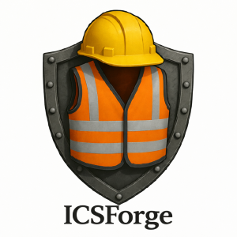
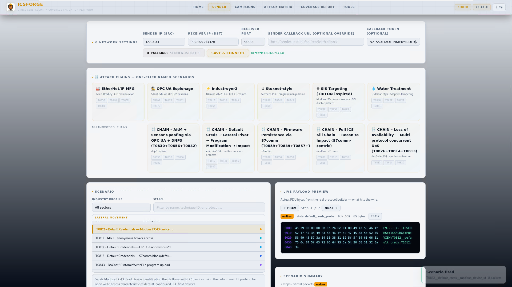
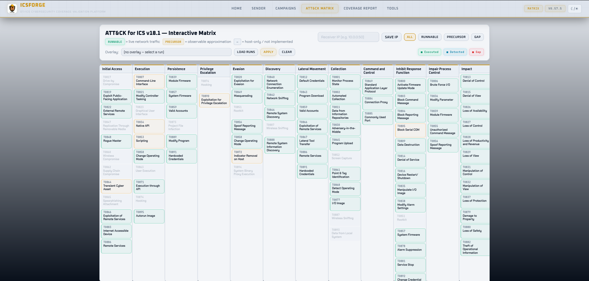
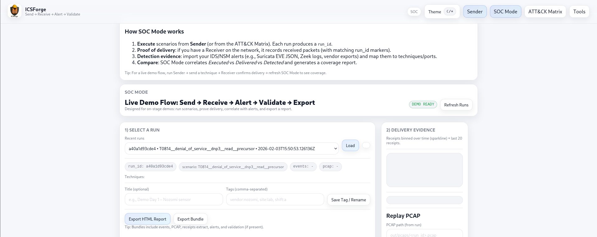
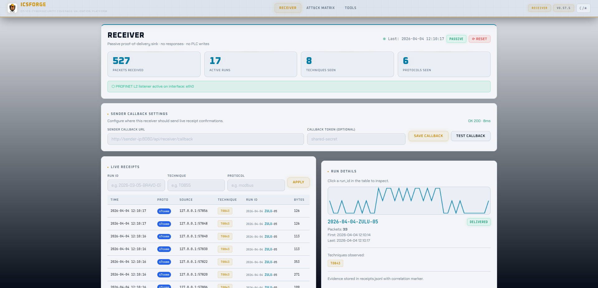
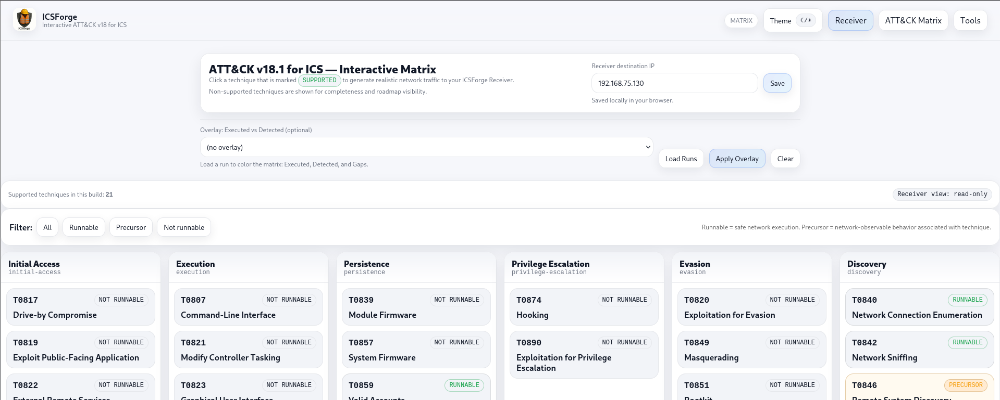
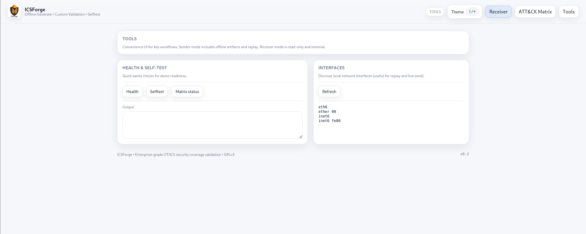

# ICSForge™

**ICSForge™** is an open-source **OT/ICS security coverage validation lab** designed to help defenders, SOC teams, and OT security engineers **validate detection, visibility, and readiness** against real-world industrial attack techniques.

ICSForge™ focuses on **what can actually be observed on the network** and generates **realistic OT traffic and PCAPs** aligned with **MITRE ATT&CK for ICS (v18)** - without exploiting real systems or causing unsafe process impact.

---

## Why ICSForge™?

Most ICS security tools promise coverage - very few let you **prove it**.

ICSForge™ helps you answer questions like:

- Can my NSM/IDS actually see Modbus manipulation attempts?
- Which MITRE ATT&CK for ICS techniques are observable on the wire?
- Do my detections fire when realistic OT traffic is sent?
- What do I miss today, and why?

ICSForge™ is **defender-first**, **safe by design**, and **honest about limitations**.

---

## Key Capabilities

### MITRE ATT&CK for ICS–Aligned Scenarios
- Scenarios mapped to **ATT&CK for ICS techniques (v18)**
- Clear distinction between runnable and non-runnable techniques
- Transparent marking in the ATT&CK matrix

### Live OT Traffic Generation
- Modbus/TCP, DNP3, IEC-104, S7comm, OPC UA, Ethernet/IP (ENIP), Profinet DCP
- Safe destination IP targeting
- No unsafe PLC interaction

### PCAP Generation
- Wireshark-clean PCAPs
- Offline generation and live capture
- Designed to trigger real IDS/NSM detections

### Sender & Receiver Architecture
- Sender: traffic generation and scenario execution
- Receiver: traffic confirmation and visibility

### SOC Mode
- Correlate executed techniques with detections
- Coverage validation workflows
- No false detection claims

---

## What ICSForge™ Is Not

- Not an exploitation framework
- Not a PLC hacking tool
- Not a malware platform
- Not a process-impact simulator

---
## 📦 Quick Start

```bash
git clone https://github.com/ICSForge/ICSForge.git
cd ICSForge
```
---

## Installation

```bash
git clone https://github.com/ICSforge/ICSforge.git
cd ICSforge
chmod +x icsforge.sh
./icsforge.sh install
```

---

## Running

```bash
sudo ./icsforge.sh web
sudo ./icsforge.sh receiver
```

Root privileges are required for real protocol ports.

---

## Scenarios

- Defined in `scenarios.yml`
- Consistent naming: `T08XX__technique__protocol__variant`
- Honest runnable vs non-runnable marking

---

## Screenshots

### Sender Dashboard


### ATT&CK for ICS Matrix


### SOC Mode – Coverage Validation


### Sender – Tools View


### Receiver – Live Traffic View


### Receiver's ATT&CK for ICS Matrix


### Receiver – Tools View


---

## License

GPLv3

---

*ICSForge • OT/ICS security coverage validation • GPLv3*
