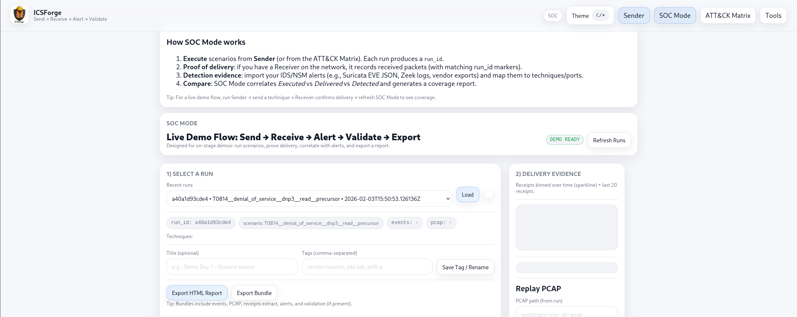

[//]: [](https://github.com/ICSforge/ICSforge/actions/workflows/ci.yml)
[](https://github.com/ICSforge/ICSforge/actions/workflows/ci.yml)
[](https://www.python.org/downloads/)
[](https://www.gnu.org/licenses/gpl-3.0)
[](https://github.com/ICSforge/ICSforge/releases)

**ICSForge™** is an open-source **OT/ICS security coverage validation platform** designed to help defenders, SOC teams, and OT security engineers validate detection, visibility, and readiness against real-world industrial attack techniques.

ICSForge focuses on what can actually be observed on the network and generates realistic OT traffic and PCAPs in **8 industrial protocols (Modbus/TCP, DNP3, S7comm, IEC-104, OPC UA, EtherNet/IP, BACnet/IP, PROFINET DCP)** which are aligned with **72 out of 83 unique techniques in MITRE ATT&CK for ICS (v18)** - without exploiting real systems or causing unsafe process impact - to help asset owners and defenders assessing the quality of existing security countermeasures such as firewalls, OT NSM sensors and ACLs and identifying hidden gaps.

ICSForge is developed with a **safe-by-design** approach, operating within a **Sender-Receiver architecture** and interacting only with the designated sender and receiver, without touching other OT devices.

> Most ICS security tools promise coverage - ICSForge lets you **prove it**.
---

## Key Numbers

| Metric | Value |
|---|---|
| **Protocols** | 8 industrial protocols (Modbus/TCP, DNP3, S7comm, IEC-104, OPC UA, EtherNet/IP, BACnet/IP, PROFINET DCP) |
| **Runnable Scenarios** | 155 in the main scenario pack |
| **ATT&CK for ICS Techniques Exercised** | 72 unique ICS technique IDs across runnable scenarios |
| **ATT&CK for ICS Matrix Coverage** | 87% (72 out of 83 technique) |
| **Detection Rules** | Auto-generated Suricata + Sigma rules per scenario |

---

## Architecture

```
┌──────────────────────┐                  ┌──────────────────────┐
│   ICSForge Sender    │  TCP/ UDP / L2   │  ICSForge Receiver   │
│                      │ ─>─>─>─>─>─>─>─> │                      │
│ • Scenario engine    │                  │ • Traffic sink       │
│ • 8 protocol builders│                  │ • Marker correlation │
│ • PCAP generation    │                  │ • Receipt logging    │
│ • Campaign playbooks │                  │ • Coverage matrix    │
│ • Web UI (:8080)     │                  │ • Web UI (:8080)     │
└──────────────────────┘                  └──────────────────────┘
           │                                          │
           ▼                                          ▼
     ┌───────────┐                            ┌──────────────┐
     │  ATT&CK   │                            │ Correlation  │
     │  Matrix   │                            │    & Gap     │
     │  Overlay  │                            │  Visibility  │
     └───────────┘                            └──────────────┘
```

On-wire **correlation markers** (`ICSFORGE_SYNTH|run_id|technique|step`) embedded in every packet enable end-to-end validation: if the receiver sees the marker, the traffic reached the wire. If your IDS fires, your detection works.

---

## Quick Start

### Install

```bash
git clone https://github.com/ICSforge/ICSforge.git
cd ICSforge
python3 -m venv .venv
source .venv/bin/activate
python -m pip install --upgrade pip
pip install -e .
chmod +x icsforge.sh
```

### Or with Docker

```bash
docker compose up
# Sender UI:   http://localhost:8080
# Receiver UI: http://localhost:8081
```

### Generate a PCAP (offline)

```bash
icsforge generate --name T0855__unauth_command__modbus --outdir out/
# → out/pcaps/offline.pcap + out/events/offline.jsonl
```

### Send live traffic to receiver

```bash
# Terminal 1: start receiver
sudo icsforge-receiver --bind 127.0.0.1

# Terminal 2: send traffic
icsforge send --name T0855__unauth_command__modbus \
  --dst-ip 127.0.0.1 --confirm-live-network
```

### Web UI

```bash
sudo ./icsforge.sh web        				# Sender dashboard on :8080
sudo ./icsforge.sh receiver   				# Receiver dashboard on :8080
sudo ./icsforge.sh receiver --l2-iface eth0 # Receiver with Profinet Listener
```

---

## What ICSForge Is Not

- Not an exploitation framework
- Not a PLC hacking tool
- Not a malware platform
- Not a process-impact simulator

ICSForge is **defender-first**, **safe by design**, and **honest about limitations**.

---

## Protocol Coverage

| Protocol | Port | Styles | Key Techniques |
|---|---|---|---|
| Modbus/TCP | 502 | 29 | T0855, T0831, T0836, T0814, T0876 |
| DNP3 | 20000 | 22 | T0855, T0816, T0815, T0856, T0858 |
| S7comm | 102 | 36 | T0855, T0813, T0845, T0882, T0889 |
| IEC-104 | 2404 | 17 | T0855, T0831, T0836, T0849, T0878 |
| OPC UA | 4840 | 16 | T0855, T0861, T0822, T0859, T0879 |
| EtherNet/IP | 44818 | 15 | T0840, T0888, T0816, T0875, T0882 |
| BACnet/IP | 47808 (UDP) | 16 | T0840, T0855, T0816, T0813, T0882 |
| PROFINET DCP | L2 | 8 | T0840, T0842, T0849 |

---

## Scenarios

- Defined in `icsforge/scenarios/scenarios.yml`
- Consistent naming: `T08XX__technique__protocol__variant`
- Honest distinction between runnable and non-runnable techniques
- Campaign playbooks for multi-step attack sequences

---

## Detection Content

ICSForge auto-generates detection rules from its scenario catalog:

```bash
# Via Web UI: Tools → Generate Detection Rules
# Preview: GET /api/detections/preview
# Download: GET /api/detections/download
```

Output formats: **Suricata rules** (.rules) and **Sigma rules** (.yml)

---

## Development

```bash
pip install -e ".[dev]"
pytest                          # run tests
pytest --cov=icsforge           # with coverage
ruff check icsforge/ tests/     # lint
```

See [CONTRIBUTING.md](CONTRIBUTING.md) for the full guide.

---

## Screenshots

### Sender Dashboard


### ATT&CK for ICS Matrix


### SOC Mode - Coverage Validation


### Receiver - Live Traffic View


---

## License

GPLv3 - see [LICENSE](LICENSE)

---

*ICSForge™ • OT/ICS Cybersecurity Coverage Validation Platform • [icsforge.nl](https://www.icsforge.nl)*
