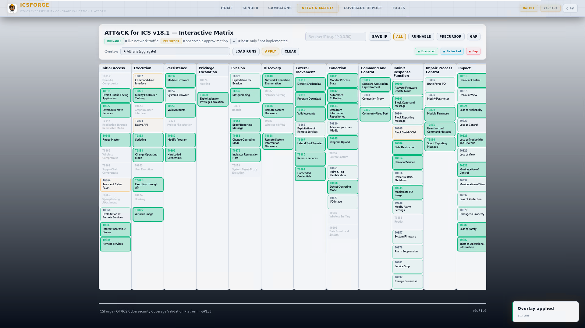
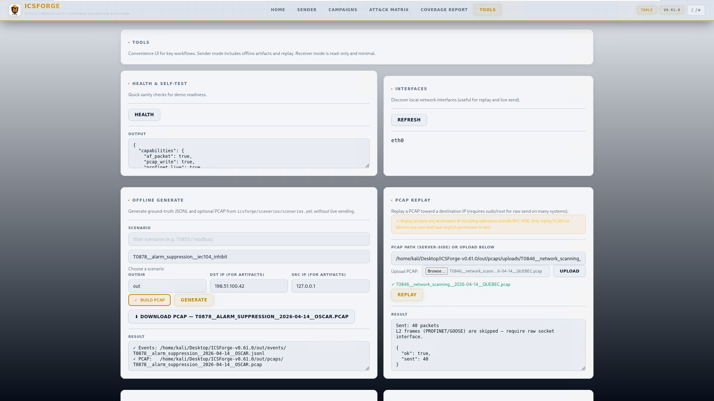

[//]: [](https://github.com/ICSforge/ICSforge/actions/workflows/ci.yml)
[](https://github.com/ICSforge/ICSforge/actions/workflows/ci.yml)
[](https://www.python.org/downloads/)
[](https://www.gnu.org/licenses/gpl-3.0)
[](https://github.com/ICSforge/ICSforge/releases)

**ICSForge™** is an open-source **OT/ICS security coverage validation platform** designed to help defenders, SOC teams, and OT security engineers validate detection, visibility, and readiness against real-world industrial attack techniques.

ICSForge focuses on what can actually be observed on the network and generates realistic OT traffic and PCAPs in **10 industrial protocols (Modbus/TCP, DNP3, S7comm, IEC-104, OPC UA, EtherNet/IP, BACnet/IP, MQTT, IEC 61850 GOOSE, PROFINET DCP)** which are aligned with **68 of 83 unique techniques in MITRE ATT&CK for ICS v18 (82% coverage)** — without exploiting real systems or causing unsafe process impact — to help asset owners and defenders assess the quality of existing security countermeasures such as firewalls, OT NSM sensors and ACLs and identify hidden gaps.

ICSForge is developed with a **defender-first** and **safe-by-design** approach around a **Sender-Receiver architecture** and interacting with the designated sender and receiver, without the need of touching other OT devices.
By default, live traffic sends are restricted to RFC 1918 / loopback addresses, and PCAP replay is restricted to private ranges unless explicitly unlocked via Tools → Send Policy.
> Most ICS security tools promise coverage - ICSForge lets you **prove it**.
---

## Key Numbers (v0.62.0)

| Metric | Value |
|---|---|
| **Protocols** | 10 industrial protocols (Modbus/TCP, DNP3, S7comm, IEC-104, OPC UA, EtherNet/IP, BACnet/IP, MQTT, IEC 61850 GOOSE, PROFINET DCP) |
| **Runnable Scenarios** | 536 standalone + 11 named attack chains = 547 total |
| **ATT&CK for ICS Techniques Implemented** | 68 unique technique IDs in scenario steps |
| **ATT&CK for ICS Matrix** | 83 unique technique IDs (94 total entries — 11 appear under multiple tactics) |
| **ATT&CK for ICS Matrix Coverage** | 82% (68 out of 83 technique) — 35 of 68 techniques at 10/10 protocols |
| **Detection Rules** | Auto-generated Suricata + Sigma rules per scenario |

---

## Architecture

```
┌───────────────────────┐                  ┌──────────────────────┐
│   ICSForge Sender     │  TCP/ UDP / L2   │  ICSForge Receiver   │
│                       │ ─>─>─>─>─>─>─>─> │                      │
│ • Scenario engine     │                  │ • Traffic sink       │
│ • 10 protocol builders│                  │ • Marker correlation │
│ • PCAP generation     │                  │ • Receipt logging    │
│ • Campaign playbooks  │   <── callback   │ • Coverage matrix    │
│ • Web UI (:8080)      │                  │ • Web UI (:9090)     │
└───────────────────────┘                  └──────────────────────┘
           │                                          │
           ▼                                          ▼
     ┌───────────┐                            ┌──────────────┐
     │  ATT&CK   │                            │ Correlation  │
     │  Matrix   │                            │    & Gap     │
     │  Overlay  │                            │  Visibility  │
     └───────────┘                            └──────────────┘
```

**How correlation works:** Every generated packet embeds an on-wire correlation marker (`ICSFORGE_SYNTH|run_id|technique|step`). When the receiver detects it, it posts a receipt back to the sender. If the receipt arrives, the packet traversed the wire. If your IDS fires on it, your detection works. Run both to prove **Executed → Delivered → Detected**.

**Stealth mode** (`--no-marker` / toggle in UI): generates bit-for-bit realistic traffic with no ICSForge tags in payloads. Confirmation switches to TCP ACK delivery. Use for IDS/NGFW validation where the marker would betray the test.

---

## Quick Start

### Install

```bash
git clone https://github.com/ICSforge/ICSforge.git
cd ICSforge
python3 -m venv .venv
source .venv/bin/activate
python -m pip install --upgrade pip
pip install -e .
chmod +x icsforge.sh
```

### Web UI

```bash
sudo ./icsforge.sh web        				# Sender dashboard on :8080
sudo ./icsforge.sh receiver   				# Receiver dashboard on :9090
sudo ./icsforge.sh receiver --l2-iface eth0 # Receiver with Profinet Listener
```
> **Token:** Generated automatically on first sender setup and shown in the setup UI. Copy it to the receiver launch command. Required for receipt integrity.

### Or with Docker

```bash
docker compose up
# Sender UI:   http://localhost:8080
# Receiver UI: http://localhost:9090
```

### Authentication

On first launch, ICSForge prompts you to create an admin account. All subsequent access requires login. Credentials are stored with scrypt KDF (N=16384, file mode 0600).

**Always-public endpoints** (no auth required): `/api/health`, `/api/version`, `/api/technique_support`, `/api/receiver/callback`.

**Callback receipt endpoint** (`/api/receiver/callback`): always requires `X-ICSForge-Callback-Token` once a token is configured (auto-generated on first setup).

**Callback registration** (`/api/config/set_callback`): loopback callers (127.x, same-host) are trusted without a token. Remote callers must supply the correct `X-ICSForge-Callback-Token`. If no token is configured, remote registration is rejected.

## Network Configuration: Receiver IP vs Destination IP

ICSForge uses two related but distinct IP concepts in the sender UI:

**Receiver IP (Network Settings panel)** — the IP of the machine running `icsforge receiver`. Setting this saves the address to persistent config and attempts to register a callback URL with the receiver so it can push receipts back to the sender automatically. It also auto-fills the Destination IP field below it.

**Destination IP (Configuration panel)** — the IP written into generated packet headers as the target address. Auto-populated from Receiver IP when you click Save & Connect, but can be overridden independently.

**Sync modes:**

| Mode | How it works | When to use |
|---|---|---|
| **Callback (default)** | Receiver POSTs receipt to sender when marker detected | Sender has a reachable callback address |
| **Pull mode** | Sender polls receiver for receipts | Sender is behind NAT or has no public address |
| **SSE** | Browser receives real-time events via Server-Sent Events | Campaigns page — live step-by-step progress |

```bash
# Set receiver IP via CLI
icsforge-receiver --callback-url http://sender-ip:8080/api/receiver/callback

# Or via API
curl -X POST http://localhost:8080/api/config/network \
  -H 'Content-Type: application/json' \
  -d '{"receiver_ip": "192.168.1.50", "receiver_port": 9090}'
```

ICSForge can be run from the **command line interface** as well;

### CLI — generate a PCAP offline

```bash
icsforge generate --name T0855__unauth_command__modbus --outdir out/
# → out/pcaps/T0855__unauth_command__<date>__<word>.pcap
#   out/events/T0855__unauth_command__<date>__<word>.jsonl
```

### CLI — send live traffic

```bash
# Terminal 1: start receiver
python -m icsforge.receiver --no-web --bind 127.0.0.1

# Terminal 2: send traffic
icsforge send --name T0855__unauth_command__modbus \
  --dst-ip 127.0.0.1 --confirm-live-network

# With stealth mode (no correlation markers in payloads)
icsforge send --name T0855__unauth_command__modbus \
  --dst-ip 127.0.0.1 --confirm-live-network --no-marker
```

### CLI — run a campaign playbook (full parity with the `/campaigns` Web UI)

```bash
# List all 11 built-in campaigns
icsforge campaign list

# Validate campaign YAML against the scenario library
icsforge campaign validate

# Fire a playbook — same SSE progress feed as the Web UI, streamed to stdout
icsforge campaign run --id industroyer2 \
  --dst-ip 127.0.0.1 --confirm-live-network
```

### CLI — generate detection rules (full parity with Tools → Download rules)

```bash
# Tier counts without writing files
icsforge detections preview

# Write Suricata .rules + per-scenario Sigma YAMLs to a directory
icsforge detections export --outdir out/detections

# Or write a zip (same layout as the Web UI download)
icsforge detections export --zip icsforge_rules.zip
```

### CLI — browse the scenario library

```bash
icsforge scenarios list --technique T0855
icsforge scenarios list --proto dnp3 --json
icsforge scenarios list --search aitm
```

### CLI — launch the live Suricata alert viewer

```bash
icsforge viewer --port 3000 --eve-path /var/log/suricata/eve.json
```

---
## Protocol Coverage

| Protocol | Port | Styles | Techniques (of 68) |
|---|---|---|---|
| OPC UA | TCP/4840 | 30 | 59/68 |
| DNP3 | TCP/20000 | 22 | 57/68 |
| S7comm (Siemens) | TCP/102 | 36 | 56/68 |
| EtherNet/IP (Allen-Bradley) | TCP/44818 | 24 | 55/68 |
| Modbus/TCP | TCP/502 | 29 | 54/68 |
| BACnet/IP | UDP/47808 | 16 | 54/68 |
| MQTT | TCP/1883 | 17 | 52/68 |
| IEC-104 | TCP/2404 | 20 | 51/68 |
| PROFINET DCP | L2/EtherType 0x8892 | 8 | 44/68 |
| IEC 61850 GOOSE | L2/EtherType 0x88B8 | 5 | 42/68 |

**IEC 61850 GOOSE** and **PROFINET DCP** are Layer 2 protocols — they require a raw socket interface (`--l2-iface eth0`) for live sends. PCAP and offline generation work without a network interface.

### Techniques at Full Coverage (10/10 protocols)

T0800, T0801, T0802, T0803, T0804, T0806, T0811, T0813, T0814, T0815, T0819, T0821, T0822, T0826, T0827, T0828, T0829, T0830, T0831, T0832, T0835, T0836, T0840, T0843, T0846, T0848, T0855, T0856, T0858, T0859, T0861, T0866, T0868, T0869, T0877, T0881, T0882, T0885, T0886, T0888, T0889, T0891 — **35 techniques** fully covered across all 10 protocols.

---

## Scenarios

Scenarios are defined in `icsforge/scenarios/scenarios.yml`.

**Naming convention:** `T08XX__<description>__<protocol>[_variant]`

**Types:**

| Type | Count | Description |
|---|---|---|
| Standalone scenarios | 536 | Single-technique, single-protocol runs |
| Named attack chains | 11 | Multi-step sequences modelling real campaigns |

**Named attack chains** include:
- **Industroyer2** — Ukraine 2022 power grid attack (IEC-104 + S7comm)
- **SIS Targeting (TRITON-inspired)** — Safety system targeting (SIS), Modbus + S7comm surrogate
- **Stuxnet-style** — Siemens PLC programme manipulation
- **Water Treatment** — Oldsmar-style setpoint tampering (Modbus + IEC-104)
- **OPC UA Espionage** — Silent data exfiltration via OPC UA sessions
- **EtherNet/IP Manufacturing** — Allen-Bradley CIP manipulation
- **AitM + Sensor Spoof** — Adversary-in-the-Middle combined with DNP3 measurement injection
- **Firmware Persistence** — S7comm firmware implant and persistence
- **Full ICS Kill Chain** — Recon to impact (S7comm + Modbus)
- **Loss of Availability** — Multi-protocol concurrent DoS (DNP3 + IEC-104 + Modbus)
- **Default Creds → Impact** — Lateral pivot to programme modification

---

## What Techniques Are Covered

ICSForge implements 68 of 83 ATT&CK for ICS techniques at the network-observable level. The remaining 15 are correctly classified as host-only, require physical access, or generate no network-observable packets — they are documented in `icsforge/data/technique_support.json` with explicit rationale per technique, and also exposed via `/api/technique_support`.

**ATT&CK matrix counts explained:**
- 83 unique technique IDs in the matrix
- 94 total matrix entries — 11 techniques appear under multiple tactics (e.g. T0856 Spoof Reporting Message appears under both Evasion and Impair Process Control, which is correct ATT&CK for ICS design)
- The `/api/matrix_status` response includes a `matrix_info` block that makes this distinction explicit

---

## Web UI Pages

| Page | URL | Purpose |
|---|---|---|
| **Home** | `/` | KPIs, top techniques by protocol coverage, scenario browser |
| **Sender** | `/sender` | Launch scenarios and chains; configure network; live payload preview; receiver feed |
| **ATT&CK Matrix** | `/matrix` | Interactive coverage overlay; click any runnable tile to fire traffic with full technique description |
| **Campaigns** | `/campaigns` | 11 named attack-chain playbooks (Industroyer2, Stuxnet, TRITON-style, Water Treatment, OPC UA Espionage, EtherNet/IP Manufacturing, Firmware Persistence, Loss of Availability, OT Credential Harvest, AitM + Sensor Spoofing, Full ICS Kill Chain) with SSE progress |
| **Report** | `/report` | Coverage report generation and inline preview; correlation gap analysis; HTML download |
| **Tools** | `/tools` | Offline PCAP generation, PCAP upload & replay, alerts ingestion, detection rule download |

---

## Key API Endpoints

### Run lifecycle

| Endpoint | Method | Description |
|---|---|---|
| `/api/send` | POST | Send a named scenario or chain live |
| `/api/generate_offline` | POST | Generate events + PCAP offline (no live traffic) |
| `/api/runs` | GET | List recent runs from SQLite registry |
| `/api/run` | GET | Receipt count + techniques for a run (`?run_id=`) |
| `/api/run_detail` | GET | Full receipt histogram for a run (`?run_id=`) |
| `/api/run_full` | GET | Complete run detail: artifacts, receipts, techniques (`?run_id=`) |
| `/api/export` | GET | Generate and download HTML report for a run (`?run_id=`) |

All three run-detail endpoints (`/api/run`, `/api/run_detail`, `/api/run_full`) merge both receipt sources — the JSONL file written by the standalone receiver process and the in-memory callback receipts — using a stable content-based deduplication key `(run_id, @timestamp, technique, proto, src_ip, src_port)`.

### Scenarios and matrix

| Endpoint | Method | Description |
|---|---|---|
| `/api/scenarios` | GET | All scenario names |
| `/api/scenarios_grouped` | GET | Scenarios grouped by ATT&CK tactic (add `?include_steps=0` for lean payload) |
| `/api/technique/variants` | GET | All runnable variants for a technique (`?technique=T0855`) |
| `/api/technique/send` | POST | Fire a single technique variant by ID |
| `/api/matrix_status` | GET | Per-technique coverage status + `matrix_info` counts |
| `/api/preview` | GET | Scenario metadata preview (`?name=`) |
| `/api/preview_payload` | GET | Live hex dump of protocol bytes for a scenario step (`?name=&step=&no_marker=`) |

### Configuration and discovery

| Endpoint | Method | Description |
|---|---|---|
| `/api/config/network` | GET/POST | Sender/receiver IPs, ports, callback URL, pull mode |
| `/api/config/receiver_ip` | POST | Set receiver IP and attempt callback registration |
| `/api/receiver/live` | GET | In-memory live receipts (last 500) |
| `/api/receiver/callback` | POST | Receipt ingest from receiver (used by receiver process) |
| `/api/version` | GET | Running version, protocol count, scenario counts (no auth required) |
| `/api/technique_support` | GET | Full technique support metadata: implementation status and ceiling rationale (no auth required) |
| `/api/health` | GET | Health check (no auth required) |

### Detection and reporting

| Endpoint | Method | Description |
|---|---|---|
| `/api/detections/download` | GET | Download Suricata + Sigma rules |
| `/api/report/generate` | POST | Generate coverage report HTML for a run |
| `/api/report/download` | POST | Download generated report as HTML file |
| `/api/alerts/ingest` | POST | Import Suricata EVE JSONL for correlation (`{"path": "out/alerts/eve.json", "profile": "suricata_eve"}`) |
| `/api/pcap/upload` | POST | Upload a PCAP file to the server for replay |
| `/api/pcap/replay` | POST | Replay a PCAP against a destination IP |

Note: `/api/alerts/ingest` requires `path` to be **relative to the ICSForge project root** (e.g. `out/alerts/suricata_eve.json`) — absolute paths are rejected. Returns `400` with a row-specific error for malformed `alert` fields.

---

## Detection Content

ICSForge auto-generates detection rules directly from its scenario catalog:

```bash
# Via Web UI: Tools → Generate Detection Rules
# Preview:  GET  /api/detections/preview
# Download: GET  /api/detections/download

# Via CLI (v0.62+)
icsforge detections preview
icsforge detections export --outdir out/rules/						   
```

Output formats: **Suricata rules** (`.rules`) matching ICSForge correlation markers, and **Sigma rules** (`.yml`) for SIEM integration.

Three-tier rules are produced per scenario:

- **Tier 1 `lab_marker`** — requires the `ICSFORGE_SYNTH` correlation marker. Zero false positives; useful only for validating ICSForge itself.
- **Tier 2 `protocol_heuristic`** — matches protocol magic bytes at known offsets. Will fire on legitimate OT traffic. Useful for NSM visibility validation.
- **Tier 3 `semantic`** — specific function codes / CIP services / FC types at application layer. Low false-positive rate in segmented OT networks. The closest we get to firing on a real adversary. **This is the recommended tier for production deployment.**

### Reference detection coverage (v0.62.0)

Measured by `scripts/measure_detection_coverage.py` — ICSForge generates each scenario's PCAP, the three-tier Suricata rules are auto-generated, then Suricata 7.0.3 runs offline against the PCAPs and alerts are counted per tier and per protocol.

Two measurement modes produce slightly different numbers and both are included for honesty:

**Mode 1 — batched (fast, ~10 min for 536 scenarios):** all scenarios' PCAPs are merged into one file with `mergecap`, each scenario's src IP is rewritten to a unique address with `tcprewrite` for attribution, and Suricata runs once over the merged PCAP.

**Mode 2 — per-protocol (slower, accurate):** each protocol gets its own Suricata run over only its scenarios' PCAPs. Tends to produce higher hit rates because Suricata's TCP stream reassembler is never confused by cross-scenario flows.

| Tier | Batched (all 535) | Per-protocol (IEC-104 as example) |
|---|---:|---:|
| Tier 1 lab_marker | 30.1% | 88.5% |
| Tier 2 protocol_heuristic | 18.3% | 100.0% |
| Tier 3 semantic | 25.6% | 88.5% |

The per-protocol numbers are the fairer reflection of how the rules would perform in a real OT network, where Suricata sees protocol-separated traffic through its normal stream engine. The batched numbers reflect a stress-test scenario — hundreds of parallel flows, many rules firing simultaneously — which is informative but understates real-world detection.

**Per-protocol semantic-tier hit rate** (batched mode, full 535-scenario run):

| Protocol | Scenarios | Semantic hit rate |
|---|---:|---:|
| S7comm | 59 | **66.1%** |
| Modbus | 56 | **62.5%** |
| DNP3 | 57 | 42.1% |
| IEC-104 | 52 | 38.5% (88.5% in per-protocol mode) |
| MQTT | 52 | 19.2% |
| EtherNet/IP | 57 | 8.8% |
| OPC UA | 59 | 6.8% |
| BACnet/IP | 54 | 0.0% |
| IEC 61850 GOOSE | 43 | 0.0% |
| PROFINET DCP | 47 | 0.0% |

These numbers are **honest**. They represent genuine coverage gaps we are actively closing, not coverage claims pulled from a scenario-count divided by a rule-count. The gap in L2 protocols (IEC 61850, PROFINET DCP) and UDP-only protocols (BACnet/IP) reflects the detection generator's current bias toward TCP/IP application-layer rules; widening semantic coverage for these protocols is a v0.63+ roadmap item.

**Independent third-party parser validation:** all 10 protocols dissect 100% cleanly by Wireshark/tshark 4.x (same dissector library used by Malcolm's Zeek and Arkime). See `docs/third_party_validation/MALCOLM_VALIDATION_v0.62.0.md` for the per-protocol parse table.

To reproduce on your own machine:

```bash
# Install Suricata 7+ and tshark, then:
python scripts/measure_detection_coverage.py --batch \
    --out /tmp/coverage.json --markdown /tmp/coverage.md
# Runtime: ~10 minutes for all 536 scenarios with --batch mode
```

---

## Stealth Mode

Standard mode embeds `ICSFORGE_SYNTH|run_id|technique|step` bytes in every packet payload for precise end-to-end correlation. Stealth mode removes all markers:

```bash
# CLI
icsforge send --name T0855__unauth_command__modbus \
  --dst-ip 192.168.1.50 --confirm-live-network --no-marker

# Web UI: toggle "Stealth mode" before clicking Run Live
```

In stealth mode:
- **PCAP:** contains zero ICSForge-identifying bytes — bit-for-bit identical to real device traffic
- **Live payload preview:** updates immediately when stealth is toggled — shows marker-free hex
- **Events JSONL:** `icsforge.marker` is `null`; `icsforge.synthetic: true` is preserved (accurate ground-truth metadata)
- **Delivery confirmation:** switches from marker detection to TCP ACK

Use stealth mode for IDS/NGFW validation exercises where the marker would trivially identify the test traffic.

---

## Security Model

- **Destination IP enforcement:** `/api/send` and `/api/technique/send` only accept RFC1918, loopback, link-local, and TEST-NET addresses — public IPs return HTTP 403. Extend via Tools → Allowed Networks for non-RFC1918 internal ranges (persisted, no restart needed).
- **Receipt integrity:** A callback token is auto-generated on first setup and required on all receipt POSTs. Forged receipts without the correct token are rejected with 401. The token is shown in the setup UI with a one-click copy and the exact receiver launch command.
- **Callback registration:** Loopback callers (same-host) are trusted. Remote receivers must supply the matching token via `X-ICSForge-Callback-Token`.
- **Path traversal protection:** `outdir` and alert ingest `path` parameters are validated against the project root via `os.path.realpath()`.
- **CSRF protection:** All state-mutating API endpoints require `X-CSRF-Token` header matching the session token.
- **Security headers:** `X-Frame-Options: DENY`, `X-Content-Type-Options: nosniff`, `Content-Security-Policy`, `Referrer-Policy` on all responses.
- **Password storage:** scrypt KDF (N=16384, r=8, p=1, dklen=32) with random salt.
- **Rate limiting:** 5 login attempts per 60 seconds per IP; 5-minute lockout.
- **Upload limits:** PCAP uploads capped at 100 MB.


---

## Development

```bash
pip install -e ".[dev]"
pytest                          # run tests
pytest -q tests/test_e2e_pipeline.py -p no:cov  # E2E pipeline tests
ruff check icsforge/ tests/     # lint (should be clean)
python scripts/smoke_test.py    # 35/35 quick sanity check
```

### Testing

```
tests/
├── test_web_api.py         — API endpoint tests
├── test_auth.py            — Auth flow and rate limiting
├── test_sse_campaigns.py   — Campaign SSE streaming
└── test_e2e_pipeline.py    — End-to-end pipeline integration (7 tests)
```

---

## What ICSForge Is Not

- Not an exploitation framework — it does not exploit vulnerabilities
- Not a PLC hacking tool — it does not modify real device state
- Not a malware platform — it generates synthetic traffic only
- Not a process-impact simulator — safe-by-design for OT environments
- Not a full protocol-faithful emulator — it generates realistic synthetic traffic optimised for detection validation, not device interoperability testing

ICSForge is **defender-first**, **safe by design**, and **honest about what each technique requires** — explicit about which techniques cannot be simulated over the network and why.

---

## Protocol Notes

**Layer 2 protocols (IEC 61850 GOOSE, PROFINET DCP)** require a raw network interface and the same L2 broadcast domain (no routers between sender and receiver):
```bash
# Receiver — start with L2 listener
sudo ./icsforge.sh receiver --l2-iface eth0

# Sender — set Interface (L2) field in the UI, or:
sudo ./icsforge.sh web  # then set iface=eth0 in sender UI
```
Both PROFINET DCP (`01:0E:CF:00:00:00`) and GOOSE (`01:0C:CD:01:00:00`) listeners start automatically with `--l2-iface`. Raw socket access requires root or `CAP_NET_RAW`. Offline PCAP generation works without an interface.

**MQTT** generates all packet types including CONNECT (with credentials and Will message), PUBLISH, SUBSCRIBE, UNSUBSCRIBE, PINGREQ, and DISCONNECT. All 17 styles produce spec-valid frames with correct `remaining_length` encoding. Requires a broker at the destination IP (default port 1883).

**DNP3** implements correct per-block CRC per IEEE 1815-2012 §8.2 — the transport layer payload is split into 16-byte blocks, each followed by its own 2-byte CRC, matching what real DNP3 outstations expect at the link layer.

**Source MAC addresses** use registered OT vendor OUIs per protocol (Siemens for S7comm, Rockwell for EtherNet/IP, Schneider for Modbus, GE/SEL for DNP3, ABB for IEC-104, etc.) — no locally-administered bit, passes OT NSM vendor lookups cleanly.

**TCP source port** is stable within a scenario run — derived deterministically from `md5(src_ip + dst_ip + run_id)` in the ephemeral range 49152–65534. All frames in a run share one source port, matching real ICS master-RTU persistent connections.

**OPC UA** sessions are coherent within a scenario run — all MSG frames share the same `sc_id` and `security_token`, with monotonically incrementing `sequence_number` and `request_id` per packet.

---

## Screenshots

### Authentication Setup


### Sender Landing Page - Dark Theme


### Sender Landing Page - Light Theme


### Sender Dashboard


### Campaigns Dashboard


### ATT&CK for ICS Matrix


### ATT&CK for ICS Matrix with Run Scenarios Overlay


### Coverage Report


### Tools for PCAP Generation and Replay


### Receiver - Live Traffic View


### Receiver - ATT&CK for ICS Matrix - Light Theme


### Receiver - ATT&CK for ICS Matrix - Dark Theme

---

## License

GPLv3 - see [LICENSE](LICENSE)

---

*ICSForge™ • OT/ICS Cybersecurity Coverage Validation Platform • [icsforge.nl](https://www.icsforge.nl)*
